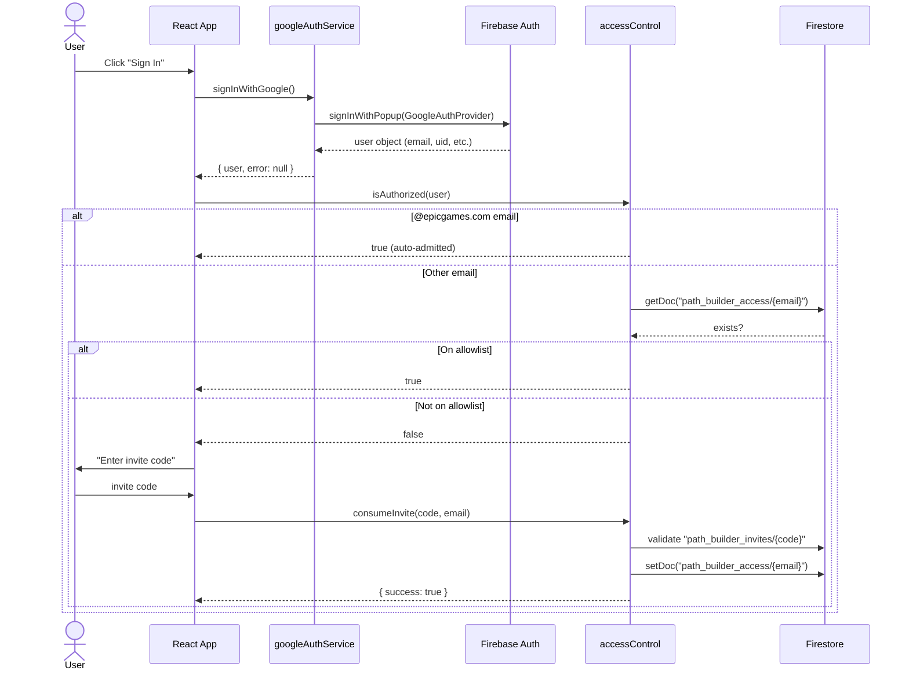
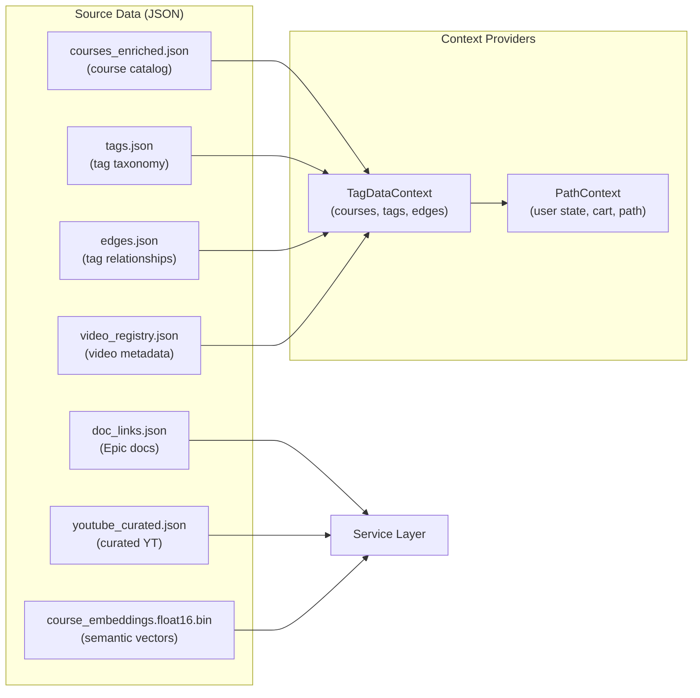
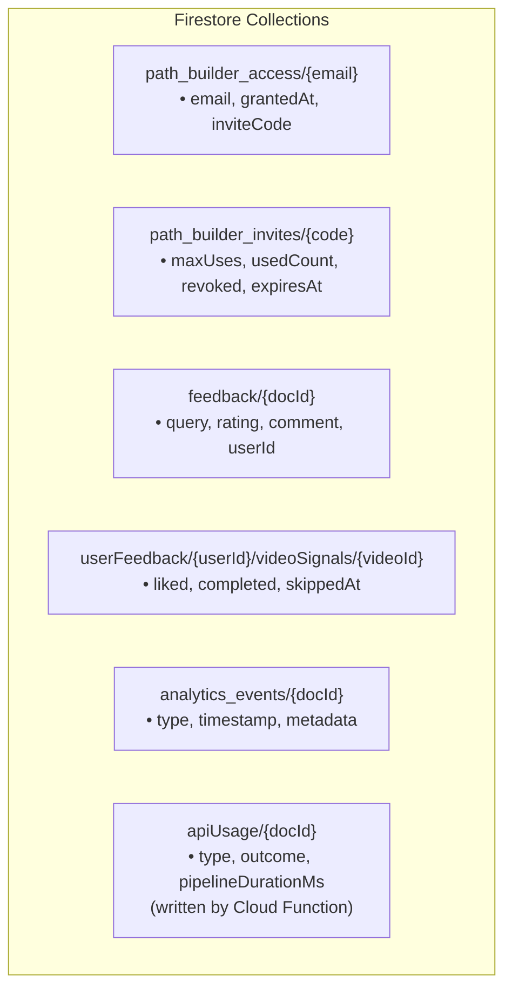
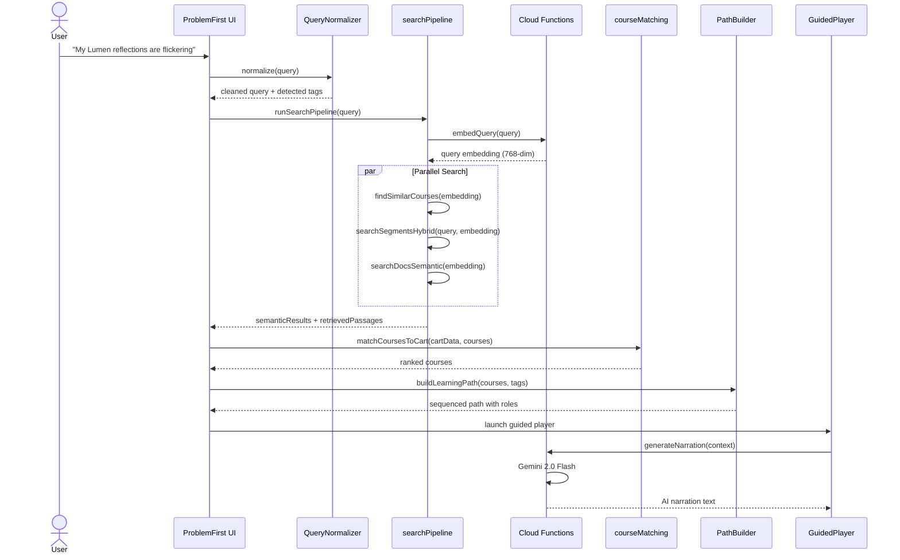
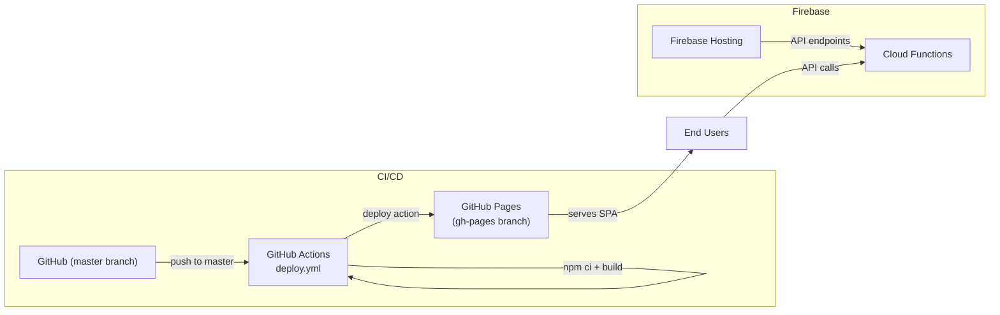

# Architecture Document

> System design, data flow, and authentication for the **Unreal Learning Path Tagging System**.

---

## System Overview

---

## Authentication Flow

Authentication uses **Firebase Auth with Google Sign-In** combined with an **invite-based access control** layer.

### Login Sequence

### Access Tiers

| Role              | Criteria                   | Capabilities                                                   |
| ----------------- | -------------------------- | -------------------------------------------------------------- |
| **Admin**         | Hardcoded email list       | All features + invite management, feedback review, tag editing |
| **Epic Employee** | `@epicgames.com` domain    | Full access, auto-admitted                                     |
| **Invited User**  | Valid invite code consumed | Full access after code validation                              |
| **Anonymous**     | No auth                    | Blocked at `AuthGate` component                                |

### Key Files

| File                   | Purpose                                             |
| ---------------------- | --------------------------------------------------- |
| `firebaseConfig.js`    | Firebase app initialization (env vars via `VITE_*`) |
| `googleAuthService.js` | Google Sign-In popup, sign-out, auth state listener |
| `accessControl.js`     | Domain check, Firestore allowlist, invite CRUD      |

---

## Data Flow

### Static Data (Build-Time)

These JSON files are bundled into the app at build time. No runtime fetching required.

### Runtime Data (Firestore)

### User Query Pipeline

This is the core data flow when a user submits a problem:

---

## Deployment Architecture

### Build Pipeline

1. Developer pushes to `master`
2. `deploy.yml` triggers: checkout → Node 20 → `npm ci` → `npm run build`
3. Firebase secrets injected as env vars (`VITE_FIREBASE_*`)
4. `JamesIves/github-pages-deploy-action` pushes `dist/` to `gh-pages` branch
5. GitHub Pages serves the SPA

### Environment Variables

All secrets are stored as **GitHub Actions secrets** and injected at build time:

| Variable                            | Purpose                        |
| ----------------------------------- | ------------------------------ |
| `VITE_FIREBASE_API_KEY`             | Firebase Web API key           |
| `VITE_FIREBASE_AUTH_DOMAIN`         | Auth domain for Google Sign-In |
| `VITE_FIREBASE_PROJECT_ID`          | Firestore project identifier   |
| `VITE_FIREBASE_STORAGE_BUCKET`      | Cloud Storage bucket           |
| `VITE_FIREBASE_MESSAGING_SENDER_ID` | FCM sender ID                  |
| `VITE_FIREBASE_APP_ID`              | Firebase app identifier        |

> **Security**: No secrets are committed to the repository. Local development uses a `.env` file (gitignored).

---

## Firestore Security Rules

- **Read/Write** on `path_builder_access` and `path_builder_invites`: authenticated users only
- **Write** on `feedback` and `analytics_events`: authenticated users, scoped to own data
- **Write** on `apiUsage`: Cloud Functions only (admin SDK)
- **Read** on `userFeedback`: scoped to authenticated user's own subcollection

---

## Key Services Reference

| Service                    | Responsibility                                | External Dependencies                                     |
| -------------------------- | --------------------------------------------- | --------------------------------------------------------- |
| `searchPipeline.js`        | Orchestrates embed → expand → search → rerank | Cloud Functions (embedQuery, expandQuery, rerankPassages) |
| `semanticSearchService.js` | Cosine similarity against course embeddings   | None (client-side)                                        |
| `segmentSearchService.js`  | TF-IDF transcript segment search              | None (client-side)                                        |
| `coverageAnalyzer.js`      | Multi-source coverage analysis                | docsSearchService, externalContentService                 |
| `PathBuilder.js`           | Sequencing, role assignment, time budgeting   | None (pure logic)                                         |
| `narratorService.js`       | AI narration generation                       | Cloud Functions (Gemini)                                  |
| `PersonaService.js`        | Persona detection + messaging                 | None (pure logic)                                         |
| `feedbackService.js`       | User feedback + video signals                 | Firestore                                                 |
| `analyticsService.js`      | Event logging                                 | Firestore                                                 |
| `accessControl.js`         | Auth gating + invite system                   | Firestore                                                 |
