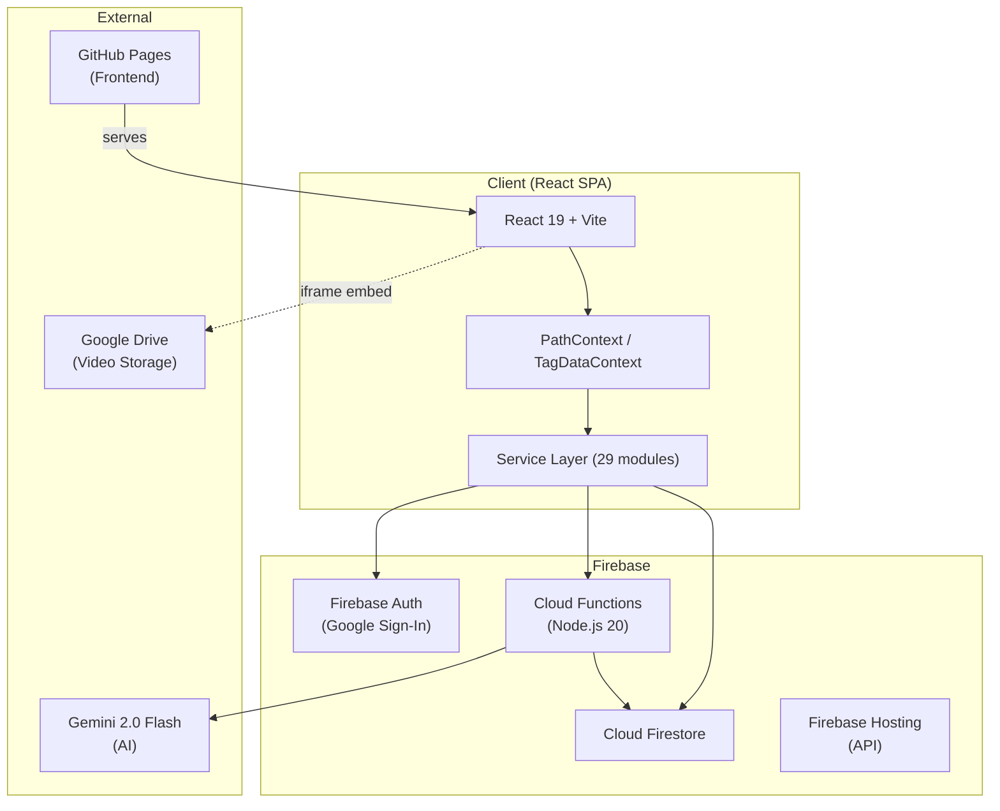
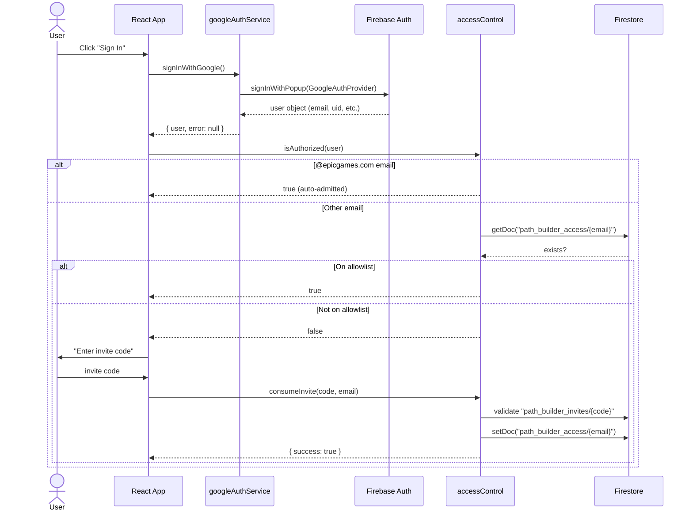
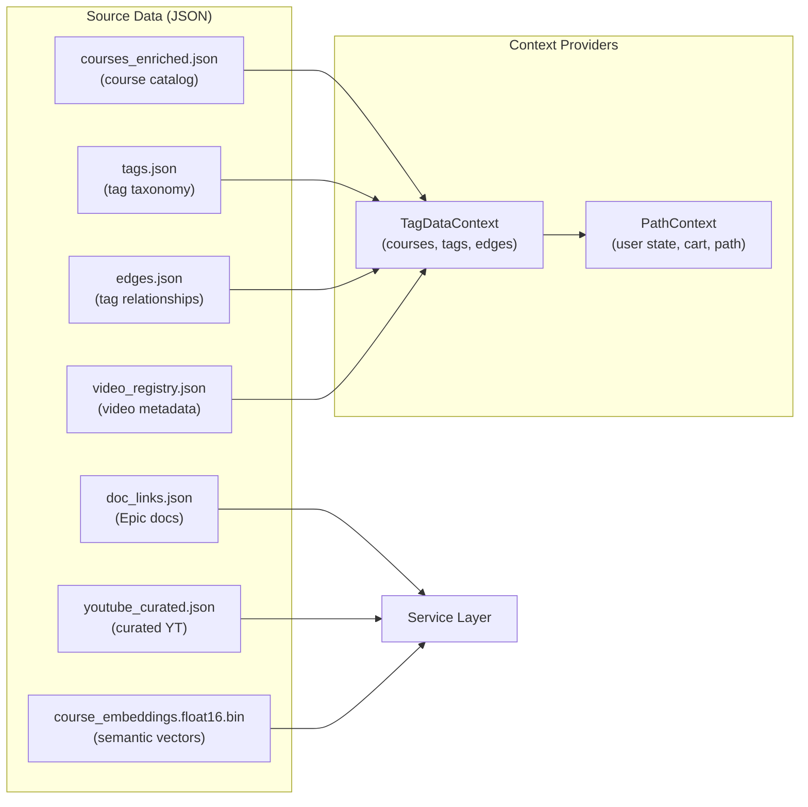
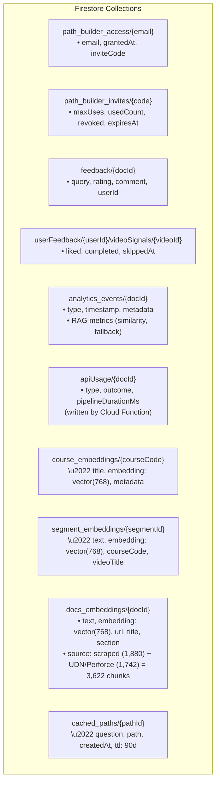
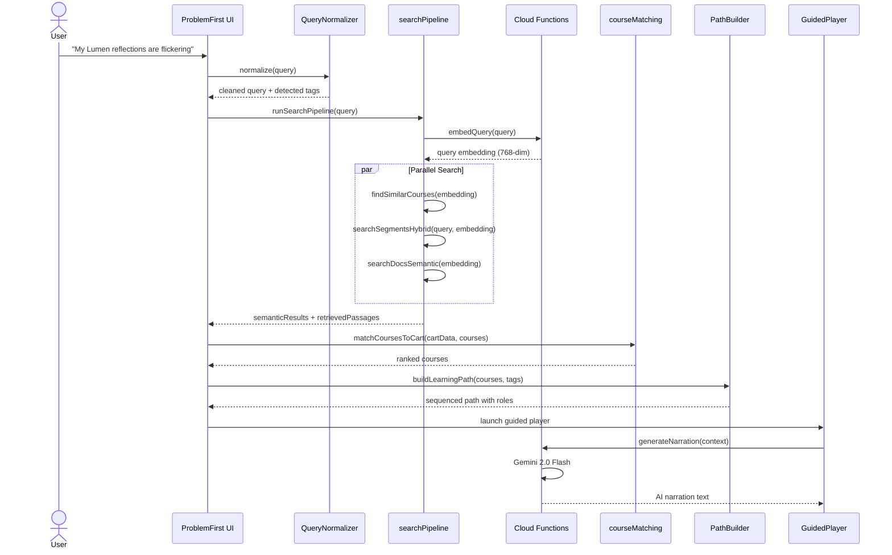
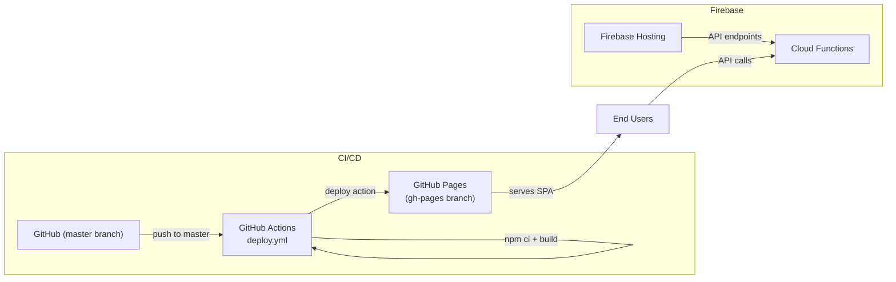
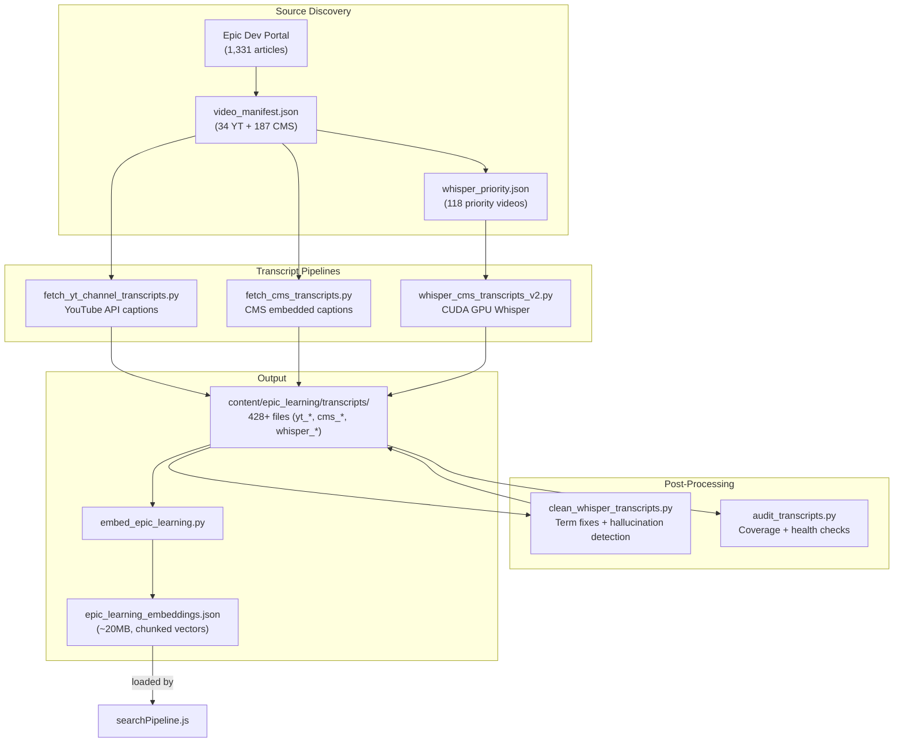

# Architecture Document

> System design, data flow, and authentication for the **Unreal Learning Path Tagging System**.

---

## System Overview



---

## Product Positioning — Design Principles

> [!IMPORTANT]
> **This platform must NOT compete with Epic's [in-editor AI Assistant](https://dev.epicgames.com/community/assistant/unreal-engine/).** Our tool and Epic's tool serve complementary roles.

| Concern     | Epic's In-Editor AI Assistant                                      | Our Platform                                                                                                               |
| ----------- | ------------------------------------------------------------------ | -------------------------------------------------------------------------------------------------------------------------- |
| **Focus**   | Step-by-step procedural help                                       | Conceptual "why" understanding                                                                                             |
| **Context** | Inside UE5 Editor                                                  | Web-based, outside the editor                                                                                              |
| **Answers** | "How do I fix this?"                                               | "Why is this happening?"                                                                                                   |
| **Content** | Procedural instructions, node-by-node steps                        | Root causes, system interactions, design patterns                                                                          |
| **Example** | "1. Open Details Panel → 2. Enable Lumen → 3. Set quality to High" | "Lumen uses software ray tracing by default because hardware RT requires specific GPU features. Flickering occurs when..." |

### Guiding Rules

1. **Fix a Problem** mode surfaces _why_ an issue occurs — root causes, system interactions, common misconceptions
2. **Learning Path** mode teaches _why_ things work the way they do — concepts, architecture decisions, design patterns
3. **Never** provide rote step-by-step instructions — that's Epic's in-editor assistant's job
4. RAG content (video transcripts, expert lectures) naturally supports this — instructors explain _reasoning_, not just _clicks_

### Product Vision: Bespoke On-Demand Learning Paths

> [!TIP]
> The north-star output is a **personalized video learning path generated on demand** from a user's question.

When a user asks "Why are my Lumen reflections flickering?", the platform should:

1. **Identify relevant video segments** from Epic's expert lectures (using RAG + transcript search)
2. **Sequence them into a curated playlist** that explains the _why_ — e.g., how Lumen's software RT works, what triggers flickering, how scene complexity interacts with the GI system
3. **Output a guided video experience** — each clip teaches the reasoning behind the solution, not just the steps
4. The result: a bespoke learning path that **helps the user understand what they're doing and why**, not just _how_ to do it

---

## Authentication Flow

Authentication uses **Firebase Auth with Google Sign-In** combined with an **invite-based access control** layer.

### Login Sequence



### Access Tiers

| Role              | Criteria                   | Capabilities                                                   |
| ----------------- | -------------------------- | -------------------------------------------------------------- |
| **Admin**         | Hardcoded email list       | All features + invite management, feedback review, tag editing |
| **Epic Employee** | `@epicgames.com` domain    | Full access, auto-admitted                                     |
| **Invited User**  | Valid invite code consumed | Full access after code validation                              |
| **Anonymous**     | No auth                    | Blocked at `AuthGate` component                                |

### Key Files

| File                   | Purpose                                             |
| ---------------------- | --------------------------------------------------- |
| `firebaseConfig.js`    | Firebase app initialization (env vars via `VITE_*`) |
| `googleAuthService.js` | Google Sign-In popup, sign-out, auth state listener |
| `accessControl.js`     | Domain check, Firestore allowlist, invite CRUD      |

---

## Data Flow

### Static Data (Build-Time)

These JSON files are bundled into the app at build time. No runtime fetching required.



### Runtime Data (Firestore)



> **Completed Migration**: Embedding vectors have been migrated from bundled JSON files to Firestore collections with native vector search (`findNearest()` KNN). This removed ~33MB from the client bundle and enabled server-side semantic search.

### User Query Pipeline

This is the core data flow when a user submits a problem:



---

## Deployment Architecture



### Build Pipeline

1. Developer pushes to `master`
2. `deploy.yml` triggers: checkout → Node 20 → `npm ci` → `npm run build`
3. Firebase secrets injected as env vars (`VITE_FIREBASE_*`)
4. `JamesIves/github-pages-deploy-action` pushes `dist/` to `gh-pages` branch
5. GitHub Pages serves the SPA

### Environment Variables

All secrets are stored as **GitHub Actions secrets** and injected at build time:

| Variable                            | Purpose                        |
| ----------------------------------- | ------------------------------ |
| `VITE_FIREBASE_API_KEY`             | Firebase Web API key           |
| `VITE_FIREBASE_AUTH_DOMAIN`         | Auth domain for Google Sign-In |
| `VITE_FIREBASE_PROJECT_ID`          | Firestore project identifier   |
| `VITE_FIREBASE_STORAGE_BUCKET`      | Cloud Storage bucket           |
| `VITE_FIREBASE_MESSAGING_SENDER_ID` | FCM sender ID                  |
| `VITE_FIREBASE_APP_ID`              | Firebase app identifier        |

> **Security**: No secrets are committed to the repository. Local development uses a `.env` file (gitignored).

---

## Video Transcript Pipeline

Transcripts are the foundation of the RAG search system. Three sources feed into `content/epic_learning/transcripts/`:



### Whisper 2-Phase Architecture

| Phase | Tool              | Purpose                                                                                                    |
| ----- | ----------------- | ---------------------------------------------------------------------------------------------------------- |
| **A** | Playwright + DASH | Opens CMS embed pages, intercepts network requests, captures base64-encoded MPD XML manifests              |
| **B** | ffmpeg + Whisper  | Downloads audio streams via ffmpeg, transcribes with OpenAI Whisper on CUDA GPU (`base` or `medium` model) |

Phase A results are cached in `cms_stream_urls_v2.json`, allowing Phase B to be re-run independently for failed or missing transcriptions.

## Firestore Security Rules

- **Read/Write** on `path_builder_access` and `path_builder_invites`: authenticated users only
- **Write** on `feedback` and `analytics_events`: authenticated users, scoped to own data
- **Write** on `apiUsage`: Cloud Functions only (admin SDK)
- **Read** on `userFeedback`: scoped to authenticated user's own subcollection

---

## Bespoke Learning Path Architecture

The **Bespoke Path** and **Adaptive Path** components generate personalized learning paths using a modular 4-stage pipeline (v7.0.0 architecture):

```
User Question -> [1. pathSearch.js] -> [2. pathSequencer.js] -> [3. pathNarration.js] -> [4. Quiz] -> UI
                      ↑ bespokePathService.js orchestrates all stages ↑
```

| Stage                     | Purpose                                                                      | Backend                                  |
| ------------------------- | ---------------------------------------------------------------------------- | ---------------------------------------- |
| **Segment Finder**        | RAG search across 1,900+ transcript embeddings (similarity threshold ≥ 0.65) | Firestore vector search + Vertex AI      |
| **Workflow Intent Guard** | Rejects segments teaching wrong tools (e.g., Texture Graph for mesh setup)   | Gemini 2.0 Flash                         |
| **Hybrid Fallback**       | Generates AI content when corpus coverage is too low                         | Gemini 2.0 Flash (general UE5 knowledge) |
| **Path Sequencer**        | Orders clips into Foundation, Diagnosis, Fix, Transfer                       | Gemini 2.0 Flash                         |
| **Path Renderer**         | Generates bridge narration between clips                                     | Gemini 2.0 Flash                         |
| **Quiz Generator**        | Creates MCQs testing conceptual understanding                                | Gemini 2.0 Flash                         |

### Cloud Functions

All Cloud Functions enforce **server-side rate limiting** (per-user, per-function) with exponential backoff and retry headers.

| Function               | Purpose                                                                                              | Trigger        |
| ---------------------- | ---------------------------------------------------------------------------------------------------- | -------------- |
| `vectorSearchCourses`  | KNN search against `course_embeddings` collection                                                    | HTTPS callable |
| `vectorSearchSegments` | KNN search against `segment_embeddings` (returns cosine similarity via `distanceResultField`)        | HTTPS callable |
| `vectorSearchDocs`     | KNN search against `docs_embeddings` collection (3,622 chunks: scraped + UDN/Perforce)               | HTTPS callable |
| `classifySegments`     | Gemini relay for path sequencing with Google Search grounding (`responseMimeType: application/json`) | HTTPS callable |

### Security Guardrails

| Guard              | Attack Vector        | Defense                                                                       |
| ------------------ | -------------------- | ----------------------------------------------------------------------------- |
| Input Sanitization | Prompt injection     | 500 char limit, HTML stripping, system prompt isolation                       |
| XSS Prevention     | Script injection     | React auto-escape, DOMPurify, CSP headers                                     |
| API Key Protection | Key theft            | `.env` only, domain-restricted, quarterly rotation                            |
| Rate Limiting      | DoS / cost abuse     | Server-side per-user rate limits, 3s client throttle, $10/day circuit breaker |
| Cache Poisoning    | Harmful cached paths | Source-grounded validation, admin-only Featured pins                          |
| Data Exfiltration  | Extract prompts/data | Stateless queries, no PII in prompts                                          |
| SCORM Integrity    | Package tampering    | SHA-256 manifest, SRI attributes                                              |

---

## Adaptive Path Architecture

The **Adaptive Path** (`AdaptivePath.jsx`) extends the Bespoke Path with a diagnostic quiz that calibrates content to the user's knowledge level:

```
User Question -> [Diagnostic Quiz] -> [Knowledge Profile] -> [Depth-Adjusted Path] -> [Quiz] -> UI
```

| Stage                    | Purpose                                                 | Backend                                   |
| ------------------------ | ------------------------------------------------------- | ----------------------------------------- |
| **Diagnostic Quiz**      | Adaptive multi-question flow calibrating user knowledge | `useAdaptiveQuiz` hook + Cloud Function   |
| **Knowledge Profile**    | Maps strengths/weaknesses across UE5 domains            | Client-side aggregation                   |
| **Depth-Adjusted Path**  | Generates path biased by knowledge profile              | Gemini 2.0 Flash (Blueprint-first bias)   |
| **Knowledge Check Quiz** | End-of-path MCQs testing conceptual understanding       | `quizService.js` + `QuizEngine` component |

### Key Components

| Component                | Purpose                                                                              |
| ------------------------ | ------------------------------------------------------------------------------------ |
| `AdaptivePath.jsx`       | Main component: modal overlay with sidebar, step navigation, quiz (784 lines)        |
| `useAdaptiveQuiz.js`     | Hook managing diagnostic quiz state, scoring, knowledge profile                      |
| `usePathStepActions.js`  | Shared hook for step audio, takeaways, and deep dives (used by both path components) |
| `usePathQuiz.js`         | Shared hook for quiz generation and scoring (used by both path components)           |
| `QuizEngine.jsx`         | Reusable quiz component (shared with BespokePath)                                    |
| `quizService.js`         | Generates MCQs from path content via Gemini                                          |
| `stepBriefingService.js` | AI-generated audio briefings with auto-advance                                       |
| `bespokePathService.js`  | Orchestrator: coordinates pathSearch → pathSequencer → pathNarration (425 lines)     |
| `pathSearch.js`          | Segment search + workflow intent filtering                                           |
| `pathSequencer.js`       | Classification prompts + step sequencing via Gemini                                  |
| `pathNarration.js`       | Bridge narration generation between steps                                            |
| `quizImageBank.js`       | Maps UE5 concepts to screenshot images for diagnostic quiz questions                 |

---

## Key Services Reference

| Service                    | Responsibility                                      | External Dependencies                                     |
| -------------------------- | --------------------------------------------------- | --------------------------------------------------------- |
| `searchPipeline.js`        | Orchestrates embed → expand → search → rerank       | Cloud Functions (embedQuery, expandQuery, rerankPassages) |
| `semanticSearchService.js` | Vector search against course embeddings             | Firestore vector search                                   |
| `segmentSearchService.js`  | Hybrid keyword + semantic segment search            | Firestore vector search                                   |
| `docsSearchService.js`     | Semantic doc search + Vertex AI Search              | Vertex AI Discovery Engine, Firestore vector search       |
| `coverageAnalyzer.js`      | Multi-source coverage analysis                      | docsSearchService, externalContentService                 |
| `PathBuilder.js`           | Sequencing, role assignment, time budgeting         | None (pure logic)                                         |
| `narratorService.js`       | AI narration generation                             | Cloud Functions (Gemini)                                  |
| `PersonaService.js`        | Persona detection + messaging                       | None (pure logic)                                         |
| `feedbackService.js`       | User feedback + video signals                       | Firestore                                                 |
| `analyticsService.js`      | Event logging + RAG pipeline + content gap tracking | Firestore                                                 |
| `analyticsQueryService.js` | Analytics aggregation + RAG health metrics          | Firestore                                                 |
| `bespokePathService.js`    | Pipeline orchestrator (delegates to 3 sub-modules)  | pathSearch, pathSequencer, pathNarration                  |
| `pathSearch.js`            | Segment search + workflow intent filtering          | Cloud Functions (embedQuery, vectorSearch\*)              |
| `pathSequencer.js`         | Classification + step sequencing via Gemini         | Cloud Functions (classifySegments)                        |
| `pathNarration.js`         | Bridge narration generation                         | Cloud Functions (Gemini)                                  |
| `accessControl.js`         | Auth gating + invite system                         | Firestore                                                 |

---

## Content Gap Intelligence

The **Content Gaps** analytics sub-tab (`ContentGaps.jsx`) tracks where the corpus falls short and AI has to fill in:

```
Path Generation → trackAICoverageReport() → Firestore analytics_events → ContentGaps.jsx
```

| Metric               | Source                       | Description                                          |
| -------------------- | ---------------------------- | ---------------------------------------------------- |
| **AI Fill Rate**     | `ai_ratio` field             | % of steps that were AI-generated vs corpus-matched  |
| **Top Content Gaps** | `query_preview` + `ai_ratio` | Queries ranked by how much AI had to generate        |
| **Knowledge Gaps**   | `knowledge_gaps` array       | Aggregated learner weak areas across all generations |
| **Paths Analyzed**   | event count                  | Total `AI_COVERAGE_REPORT` events in time range      |

> [!IMPORTANT]
> The `AI_COVERAGE_REPORT` event fires in **both** code paths: the normal corpus pipeline (line ~755) and the hybrid fallback path (line ~700). Both paths must include tracking to avoid data gaps.
