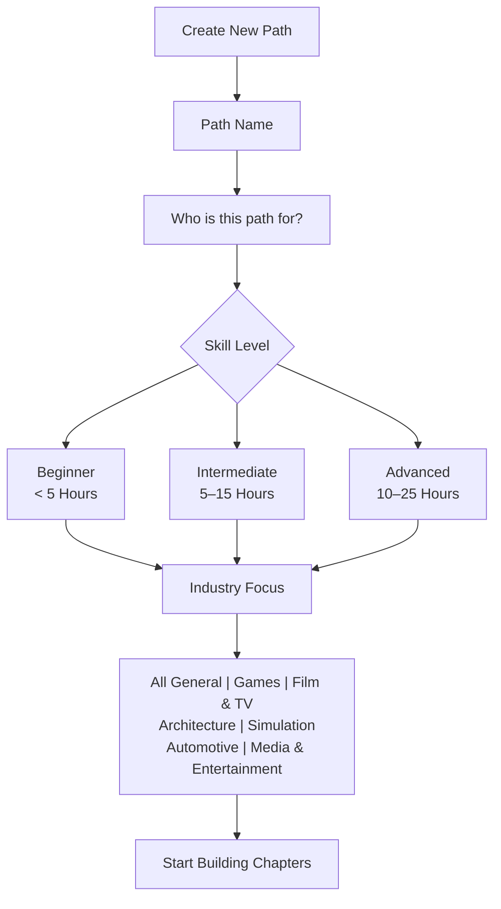
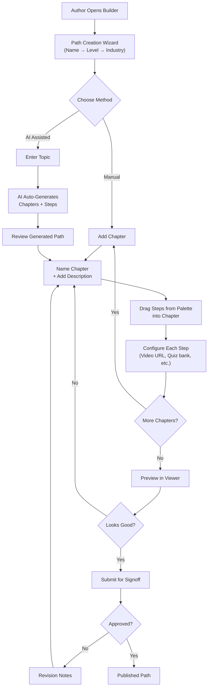
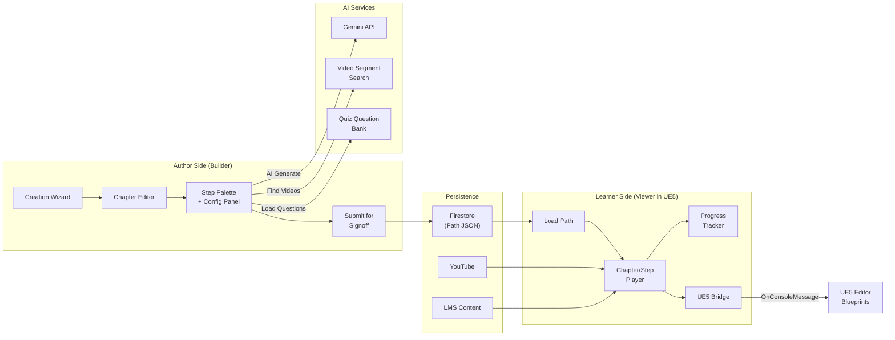

# UE5 In-Editor Learning Path System — Builder & Viewer (v3)

## Background & Problem

Feedback requires a fundamentally new approach to how learning paths are **authored** and **consumed**. The system must:

1. **Builder** (browser-based): A visual pipeline tool for authors to compose chapter-based learning paths — this is where everything gets tied together
2. **Viewer** (inside UE5): A guided learner player that runs inside UE5's Web Browser Widget (CEF/Chromium)
3. **Preview mode** in the builder so authors can see what learners will experience before publishing
4. Support video from **YouTube** and/or an **LMS**
5. Scale to **~100 learning paths** with an efficient authoring workflow
6. Produce a **stakeholder demo** first — build one real example, get buy-in, then scale

---

## Strategy: Example-First Approach

> [!IMPORTANT]
> **Phase 0 is the real deliverable.** Before building the full system, we build **one concrete example path** end-to-end as a proof of concept. This gets shown to stakeholders. If they like it, we scale.

| Phase | Goal | Deliverable |
|---|---|---|
| **Phase 0** | Build one example path + viewer mockup | Working demo of "Set up AI to patrol and chase the player" |
| **Phase 1** | Core schema + path builder | Authoring tool that can produce paths at scale |
| **Phase 2** | Path viewer inside UE5 | Learner experience running in the editor web widget |
| **Phase 3** | Scale to 100 paths | Templates, AI auto-build, signoff workflow |

---

## Pedagogical Design Principles

> [!IMPORTANT]
> These principles are drawn from the research in `/research/` and underpin every authoring decision. They are not optional flavor — they are the reason this system exists.

### 1. "Why" Before "How" (Cognitive Load Theory)

Every module must explain **why** a concept matters before showing **how** to implement it. Research shows that tutorials teaching only procedural steps produce learners who can replicate but cannot adapt when something breaks. The AI Transition step exists specifically to front-load conceptual framing before any video or doc step.

**Author rule**: Every chapter must open with an AI Transition that explains *why this chapter matters* and *what problem it solves*, not just "what you'll build."

### 2. Scaffold, Then Release (Vygotsky)

Beginner paths should provide maximum hand-holding (step-by-step video + AI augmentation + quiz). Intermediate and advanced paths should progressively remove scaffolding — replacing prescriptive videos with doc references, RAG explorations, and open-ended challenges.

| Skill Level | Scaffolding Strategy |
|---|---|
| **Beginner** | Video-first + AI "Why & How" panel + guided quiz |
| **Intermediate** | Doc/RAG-first + video as supplemental + diagnostic quiz |
| **Advanced** | RAG + source-code references + project-based challenges (no hand-holding) |

### 3. Combat "Tutorial Hell" Through Active Recall

Quiz steps are not optional gatekeeping — they are the mechanism that forces learners to retrieve knowledge rather than passively consume. Research benchmarks show that active recall improves retention by 50% over re-watching. Quizzes should test *understanding* ("Why would you use an AI Controller instead of possessing the pawn directly?") not *memory* ("What menu do you click?").

### 4. Respect Cognitive Bandwidth

Research shows learners lose focus after ~6 minutes of video and ~4 steps in a multi-step tutorial. Content guidelines below enforce these limits to maximize completion rates.

---

## Content Architecture: Chapters → Steps

Paths are **chapter-based**, not flat lists. Each chapter is a teachable module. Inside each chapter, authors arrange steps from the step-type palette in any order.

### Hierarchy

```
Learning Path
├── Metadata (name, level, industry, estimated time)
├── Chapter 1: "Setting Up the NavMesh Bounds Volume"
│   ├── AI Transition (objectives, what you'll learn)
│   ├── Content Video (YouTube tutorial)
│   ├── Quiz (5 questions, repeat till pass)
│   └── AI Transition (summary, what's next)
├── Chapter 2: "Creating the AI Character and Controller"
│   ├── AI Transition
│   ├── Content Doc Page (docs.unrealengine.com)
│   ├── Content Video
│   └── Quiz
├── Chapter 3: "Enabling and Creating a State Tree"
│   └── ...
└── ... (more chapters)
```

### Concrete Example: "Set up an Unreal AI to patrol and chase the player"

| Ch# | Chapter Title | Description |
|---|---|---|
| 1 | Setting Up the NavMesh Bounds Volume | Define the walkable area in your level so the AI can move |
| 2 | Creating the AI Character and Controller | Set up the core enemy pawn and assign an AI Controller to it |
| 3 | Enabling and Creating a State Tree | Turn on the State Tree plugin and create a new asset assigned to your AI |
| 4 | Setting Up AI Perception | Add the sight component to the AI Controller. Adjust vision radius and angle |
| 5 | Configuring State Tree Parameters and Evaluators | Add a variable for the target player. Set up an Evaluator to update it when the AI sees the player |
| 6 | Building the Roam State | Add a state with tasks that pick a random point on the NavMesh and move the AI to it |
| 7 | Building the Chase State | Add a second state with a task to move the AI directly to the target player variable |
| 8 | Adding State Transitions | Set the rules for switching states. Add a condition that forces "Roam" → "Chase" when the player is seen |

### Step-Type Palette

The building blocks authors can arrange **in any order** within a chapter:

| Step Type | Content | AI-Generated Metadata |
|---|---|---|
| **🔄 AI Transition** | Bridge between sections | Learning objectives, expected outcomes, "what's next" |
| **🎬 Content Video** | YouTube or LMS video embed | Augments to videos, "Explain Why & How" |
| **📄 Content Doc Page** | Documentation / article | Relevant snippets, possible images |
| **🤖 Content RAG Pipeline** | AI-generated content via Retrieval Augmented Generation | Pulls relevant knowledge from indexed sources, generates contextual instructional material |
| **✅ Quiz** | Knowledge check (aspirational) | 5 questions, follow-ups, repeat till pass — question banks TBD |

> [!NOTE]
> **Skippability**: Learners can skip any step or entire chapter. The viewer needs skip controls, not just "Next." Progress still tracks what was skipped vs. completed.

---

## Author Content Guidelines

> [!IMPORTANT]
> These guardrails are backed by empirical research on learner engagement, scroll depth, and completion rates (see `/research/Optimizing Tutorial Length and Structure.sty`). Violating them directly correlates with learner drop-off.

### Per-Step Limits

| Step Type | Maximum Length | Rationale |
|---|---|---|
| **Content Video** | **≤ 6 minutes** per segment | Engagement drops 50% after 6 min; use `startTime`/`endTime` to clip longer videos |
| **Content Doc Page** | **≤ 800 words** of highlighted content | >75% scroll depth target; longer docs should be split across steps |
| **Content RAG** | **≤ 500 words** generated | AI-generated walls of text kill engagement; be concise |
| **AI Transition** | **≤ 150 words** | Bridge, not a lecture — 3-4 bullet points max |
| **Quiz** | **5 questions**, 80% pass | More than 5 causes fatigue; fewer than 3 has no diagnostic value |

### Per-Chapter Limits

| Constraint | Limit | Rationale |
|---|---|---|
| Steps per chapter | **3–5 steps** | Research shows 3-4 step tutorials have highest completion rates |
| Estimated time per chapter | **10–20 minutes** | Aligns with "one focused learning session" |
| Must include at minimum | 1 AI Transition + 1 content step | Bare minimum for a teachable unit |

### Per-Path Limits

| Skill Level | Max Chapters | Max Total Time | Rationale |
|---|---|---|---|
| **Beginner** | 6–8 chapters | < 2 hours | Short wins build momentum; "Time to Fun" < 30 min for first chapter |
| **Intermediate** | 8–12 chapters | 2–5 hours | Deeper dives but still completable in a weekend |
| **Advanced** | 10–15 chapters | 5–10 hours | Assumed motivated; can handle longer arcs |

### Version Tagging (Required)

Every path must specify the **minimum UE5 version** it targets. "Versioning anxiety" is a top-3 community complaint — learners abandon tutorials they suspect are outdated.

- The `engineVersion` field in the schema is **required** at path level, **optional** at chapter level (for chapters that need a specific plugin or feature)
- Builder should display a ⚠️ staleness warning if a path targets a version > 2 minor releases behind current

---

## Path Creation Wizard

Simplified flow based on your mockup:



After completing the wizard, the author lands in the **Pipeline Builder** where they add chapters and arrange steps within each chapter.

---

## Process Flowcharts

### 1. Author Workflow — Building a Learning Path



### 2. Learner Experience — Consuming a Path in UE5


### 3. System Architecture



---

## UE5 Web Widget Constraints

> [!NOTE]
> These constraints apply to the **Viewer only**. The Builder runs in a normal browser and is not limited by CEF.

| Constraint | Impact (Viewer only) |
|---|---|
| **Chromium 90** (2021) | No modern CSS (`container-queries`, `@layer`). Use well-supported CSS only. |
| **CPU-only rendering** | No heavy animations, no WebGL. Keep it lightweight. |
| **Aggressive caching** | Cache-busting with versioned URLs |
| **YouTube iframes OK** | YouTube handles its own decoding — works in CEF |
| **UE5 ↔ Web comms** | `OnConsoleMessage` (web → UE5) and `ExecuteJavascript` (UE5 → web) |

### Design Response
- **Dark UE5 editor aesthetic** — match the dark-themed mockup style (viewer)
- **Vanilla CSS** — maximum Chromium 90 compatibility (viewer); builder can use modern CSS
- **React 18 + Vite** — keep existing toolchain, self-contained `dist/` bundles
- **No heavy dependencies in viewer** — native HTML5 drag in builder is fine
- **JSON data model** — paths stored in Firestore
- **Preview mode in builder** — renders a lightweight version of the viewer inline so authors can see what learners will experience

---

## Updated Data Schema

```json
{
  "id": "path-uuid",
  "title": "Set up an Unreal AI to patrol and chase the player",
  "version": 1,
  "status": "draft | review | approved | published",
  "author": "Sam Deiter",
  "reviewedBy": null,

  "metadata": {
    "skillLevel": "intermediate",
    "estimatedHours": "5-15",
    "industryFocus": ["games"],
    "engineVersion": "5.5",
    "prerequisites": ["path-uuid-basics"],
    "tags": ["AI", "State Tree", "NavMesh", "AI Perception"]
  },

  "chapters": [
    {
      "id": "ch-uuid",
      "title": "Setting Up the NavMesh Bounds Volume",
      "description": "Define the walkable area in your level so the AI can move",
      "engineVersion": null,
      "skippable": true,
      "steps": [
        {
          "id": "step-uuid",
          "type": "AI_TRANSITION",
          "config": { "objectives": ["..."], "expectedOutcome": "..." },
          "aiGenerated": { "narrative": "..." },
          "skippable": true
        },
        {
          "id": "step-uuid",
          "type": "CONTENT_VIDEO",
          "config": {
            "videoUrl": "https://youtube.com/watch?v=...",
            "source": "youtube",
            "title": "NavMesh Setup Tutorial",
            "startTime": 0,
            "endTime": null
          },
          "aiGenerated": { "whyAndHow": "...", "augmentations": [] },
          "skippable": true
        },
        {
          "id": "step-uuid",
          "type": "QUIZ",
          "config": {
            "questionCount": 5,
            "passingScore": 0.8,
            "retryAllowed": true,
            "bankId": "navmesh-basics"
          },
          "skippable": false
        }
      ]
    }
  ]
}
```

---

## What We Can Reuse

| Existing Asset | Reuse Strategy |
|---|---|
| `bespokePathService.js` | Powers "AI Auto-Build" for generating chapters from a topic |
| `quizService.js` | Extend later for per-step quiz with retry-till-pass (aspirational) |
| `geminiService.js` | AI transition, augmentation, and RAG content generation |
| `segmentSearchService.js` | Finding relevant YouTube segments |
| `searchPipeline.js` / `docsSearchService.js` | Powers the RAG pipeline step type |
| Firebase Auth / Firestore | Persistence + access control as-is |

---

## Resolved Questions

| # | Question | Answer |
|---|---|---|
| 1 | Content Rap Pipeline? | It's the **RAG pipeline** — Retrieval Augmented Generation, not music |
| 2 | Hosting? | Still TBD — likely Firebase-hosted URL |
| 3 | Quiz banks? | **Aspirational** — just an idea for now, not a priority |
| 4 | Builder location? | **Browser-based**. Builder ties everything together; only the viewer runs in UE5 |
| 5 | SCORM export? | **No**. Need a **preview mode** instead so authors can see what they're making |
| 6 | Signoff workflow? | **TBD** — not sure yet, will define later |

---

## Remaining Open Question

1. **Hosting** — Firebase-hosted URL loaded in UE5, or local HTML files bundled with a UE5 plugin, or either?

---

## Content Priority Roadmap

> [!IMPORTANT]
> This roadmap answers **"Which 100 paths do we actually build?"** — prioritized by severity of the gap in the current UE5 ecosystem. Derived from 11 research documents analyzing community complaints, forum data, and industry trends.

### Tier 1 — Critical Gaps (Build First)

These topics have the highest demand and the worst existing tutorial quality. They directly address the "Intermediate Void" — the biggest structural failure in UE5 education.

| # | Topic Area | Example Path Titles | Why It's Critical |
|---|---|---|---|
| 1 | **Software Architecture** | "Building Decoupled Game Systems with Interfaces" / "Data-Driven Design with GameplayTags and Data Assets" | Community's #1 complaint — tutorials teach naive, unscalable patterns |
| 2 | **Blueprint ↔ C++ Dual Workflow** | "Exposing C++ Systems to Blueprint" / "When to Use C++ vs Blueprint" | Industry standard, almost never taught correctly |
| 3 | **UI Architecture (MVVM)** | "Event-Driven UI with Common UI" / "Decoupling UI from Game Logic" | Current UI tutorials actively teach circular dependencies |
| 4 | **Gameplay Ability System (GAS)** | "GAS from Scratch" / "Networked Abilities with GAS" | Most requested advanced topic; very few quality resources |
| 5 | **AI & State Trees** | "AI Patrol and Chase" (Phase 0 example) / "Mass Entity Crowds" | State Trees replacing Behavior Trees; Mass ECS is almost undocumented |

### Tier 2 — High Demand (Build After Tier 1)

| # | Topic Area | Example Path Titles | Gap Severity |
|---|---|---|---|
| 6 | **Animation: Motion Matching** | "Motion Matching from Scratch" / "GASP Integration" | New system, very few tutorials |
| 7 | **Optimization & Profiling** | "Profiling with Unreal Insights" / "Nanite & Lumen Budget Management" | Treated as afterthought; indie games suffer |
| 8 | **Networking & Iris** | "Multiplayer Fundamentals" / "Migrating to Iris Replication" | Iris is experimental with almost no docs |
| 9 | **PCG Advanced Workflows** | "Grammar-Based Building Generation" / "Runtime PCG" | Huge interest, only basic tutorials exist |
| 10 | **Rendering: Substrate & MegaLights** | "Substrate Materials Deep Dive" / "High-Density Dynamic Lighting" | Production-ready in 5.7, zero mainstream tutorials |

### Tier 3 — Emerging & Enterprise (Build for Scale)

| # | Topic Area | Example Path Titles | Audience |
|---|---|---|---|
| 11 | **Virtual Production** | "LED Volume Setup with nDisplay" / "Color Science for VP" | Film/TV studios |
| 12 | **Automotive HMI** | "Building a Digital Dashboard" / "CAN Bus Telemetry in UE5" | Automotive engineers |
| 13 | **Digital Twins & Simulation** | "Datasmith Pipeline for ArchViz" / "Robotics Sim with AirGen" | Architecture, manufacturing |
| 14 | **Nanite Assemblies & USD** | "Houdini → USD → Nanite Foliage Pipeline" | Environment artists |
| 15 | **Verse Language** | "Functional Programming for UE Developers" / "Verse Beyond UEFN" | Future-proofing for UE6 |

### Tier 4 — Beginner Onboarding (Parallel Track)

These run alongside the main roadmap to address the "10-Hour Churn" — the massive drop-off in the first hours.

| # | Topic | Purpose |
|---|---|---|
| B1 | **"Your First 30 Minutes in UE5"** | Time-to-Fun < 30 min, visual payoff immediately |
| B2 | **"Troubleshooting Your UE5 Setup"** | Addresses top 10 hardware/IDE/shader friction points |
| B3 | **"Blueprint Fundamentals: Think Like a Programmer"** | Teaches logic patterns, not just node connections |
| B4 | **"Understanding the UE5 Framework Classes"** | GameMode, GameState, PlayerController — the "why" |

---

## Adaptive Learning — Future Phases

> [!NOTE]
> These features are **not in scope for Phases 0–2** but the schema supports them. Documenting here so we don't paint ourselves into a corner.

- **`prerequisites` field** (schema, added): Enables dependency graphs between paths. The viewer can eventually warn "You should complete X before starting this path."
- **Skill profiling**: A future pre-path diagnostic quiz that routes learners to the right difficulty level.
- **Dynamic path adjustment**: If a learner aces all quizzes, skip scaffolding steps automatically. If they fail, inject remediation modules.
- **Knowledge persistence**: Track completed topics across paths so returning learners don't repeat content.

---

## Next Steps (After Approval)

1. **Generate visual mockups** of the learner viewer (dark UE5 aesthetic) for stakeholder presentation
2. **Build the example path** ("AI patrol and chase") as a static JSON to validate the schema
3. **Build the viewer** first (the stakeholder demo) — this gets shown to others to see if they like it
4. **Build the builder** tooling after buy-in is confirmed
